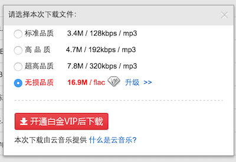

# baiduMusic
免费下载百度音乐无损歌曲

有些朋友可能在[百度音乐](http://music.baidu.com/)希望下载无损音乐，这需要百度白金VIP。可能网上有的教程有下载高品质音乐的方法：

**加入红心收藏，然后再下载** 

(参考:http://jingyan.baidu.com/article/870c6fc3365e84b03fe4bed4.html)

但对于无损音乐，

你还是无法下载。

## SAE上的演示
**已经部署在新浪 SAE **: http://bbmusic.sinaapp.com/ ，并参见[使用说明帮助](http://bbmusic.sinaapp.com/help.html)。

##介绍
本项目可以解决这一问题。

当然有三个前提：

- 该音乐有无损版本
- 已经登陆
- 加入了红心收藏

**已经部署在新浪 SAE **: http://bbmusic.sinaapp.com/  

主要代码在index.html的JS部分，很简单。如果你希望用户**免登陆，且不需要直接加入收藏，直接提供地址即可**，只需要一个**已知账号收收藏了足够多的音乐即可**。

##Future work
为了使项目真的有实用性，可以鼓励用户提交一个自己的类似于token的信息，这样在这个平台可以做到分布式共享无损音乐（建立一个类似P2P的无限容量的无损音乐库）。如果大家有这个需求，欢迎Email联系，我会对其再次开发。

email : 18789482356@163.com

##版权问题
如果涉及版权问题，项目将立刻关闭。
